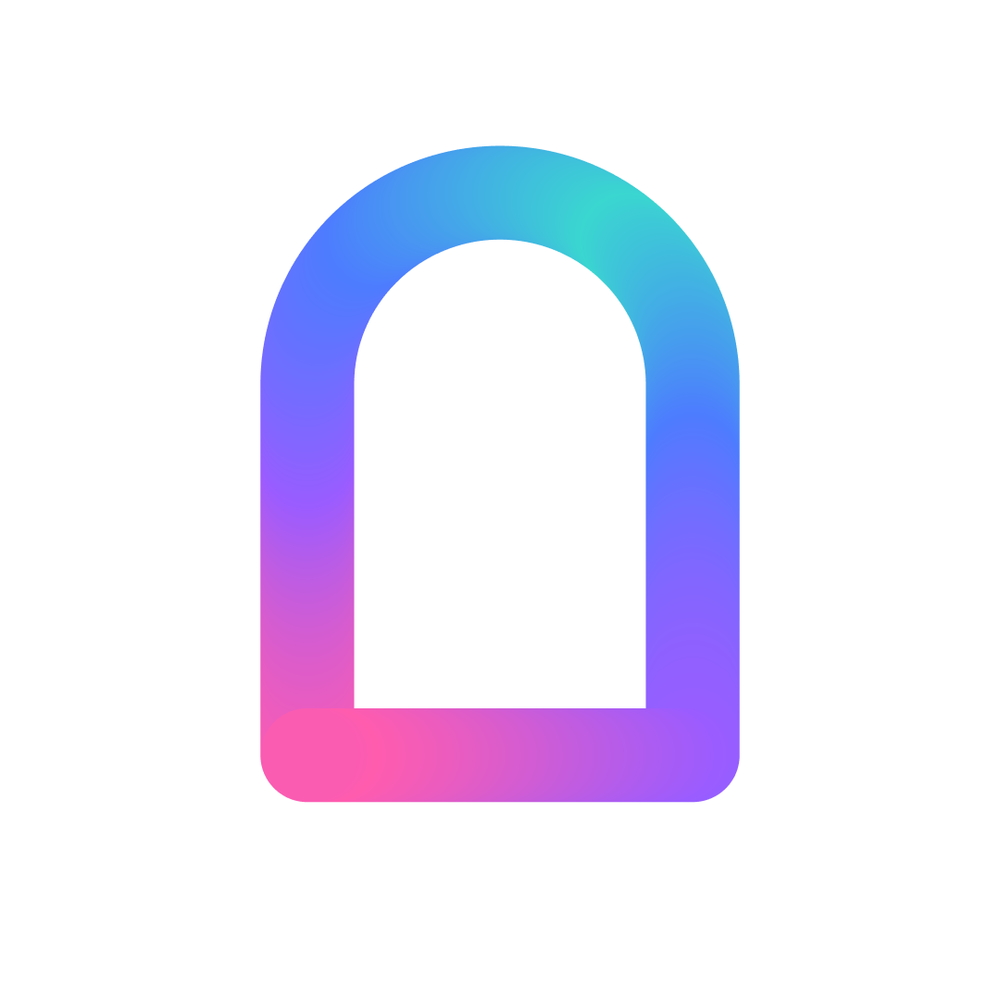

<div align="center">

  

  # PordalTV

  **All of your streaming services. One app.**

  <p>Sign in once, search everywhere, press play.</p>

  <p>
    <a href="https://github.com/pordal-app/PordalTV/releases"></a>
    
    
    <a href="LICENSE"></a>
  </p>

</div>

## The idea

Watching TV now means juggling half a dozen apps, each with its own search, its
own watchlist, and its own idea of where you left off. Pordal's goal is to
collapse that into a single front door: sign into each of your OTT platforms
once, and Pordal handles the rest —

- **One search** across every service you subscribe to
- **One browsing surface** — home screen, discovery, and watchlists that span
  services instead of being siloed inside them
- **One place to press play** — Pordal figures out which of your services has
  the title and starts playback

## Where it is today

Pordal is early, and this repo is the foundation: a fork of the open-source
[NuvioTV](https://github.com/NuvioMedia/NuvioTV) project, chosen as a
quickstart for a great TV playback experience and UI. Enormous credit to the
NuvioTV authors and contributors — the player engine, addon client, and UI
foundations are theirs. This fork trims the experience to a proof-of-concept
shape (features are gated, not removed) and rebrands the surface.

Today the app boots straight into a curated home screen, resolves content
through Stremio-compatible addons, and plays with a click. From here, the
roadmap builds toward the multi-service vision:

- [x] TV-first playback and browsing foundation
- [ ] OTT platform sign-in and account linking
- [ ] Unified cross-service search
- [ ] Cross-service browsing, watchlists, and continue-watching
- [ ] Playback handoff to the right service for each title

## Installation

Sideload the APK for your device architecture from
[Releases](https://github.com/pordal-app/PordalTV/releases) (arm64-v8a for
virtually all modern TV devices). Release builds check GitHub for updates and
prompt in-app.

## Building

JDK 17 and the Android SDK (platform 36) are required. Create
`local.properties` at the repo root with at least:

```properties
sdk.dir=/path/to/Android/sdk
TMDB_API_KEY=your_tmdb_v3_api_key
NUVIO_SUPABASE_URL=https://placeholder.invalid
NUVIO_SUPABASE_ANON_KEY=placeholder
NUVIO_RELEASE_KEY_ALIAS=nuviotv
NUVIO_RELEASE_KEY_PASSWORD=your_keystore_password
NUVIO_RELEASE_STORE_PASSWORD=your_keystore_password
```

All builds (including debug) sign with the release config: generate a
throwaway keystore at the repo root with
`keytool -genkeypair -keystore nuviotv.jks -alias nuviotv`. Then:

```sh
./gradlew :app:assembleFullDebug
```

## Documentation

Project documentation lives in [docs/PLAN.md](docs/PLAN.md); every deviation
from upstream is tracked in [docs/REVERT-LEDGER.md](docs/REVERT-LEDGER.md).

## License

Licensed under the [GNU General Public License v3.0](LICENSE), as inherited
from NuvioTV. Source code for this fork is maintained at
[pordal-app/PordalTV](https://github.com/pordal-app/PordalTV).

Metadata and artwork are provided by [TMDB](https://www.themoviedb.org/). This
product uses the TMDB API but is not endorsed or certified by TMDB.
